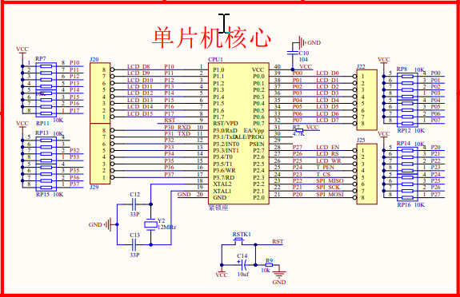
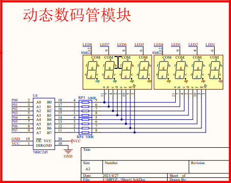

## Nixie Tube For STC89C516RD+ A4

**Connection mode:**

You can also use it by fixing the corresponding port.
**In these LED package, typically all of the cathodes (negative terminals) of the segment LEDs are connected**

<u>In the Head, I encapsulate the corresponding hexadecimal P0 register input of some numbers.</u>

*This project records my learning experience. So if some predestined person see it, give some advice, which helps me a lot!❤️*
